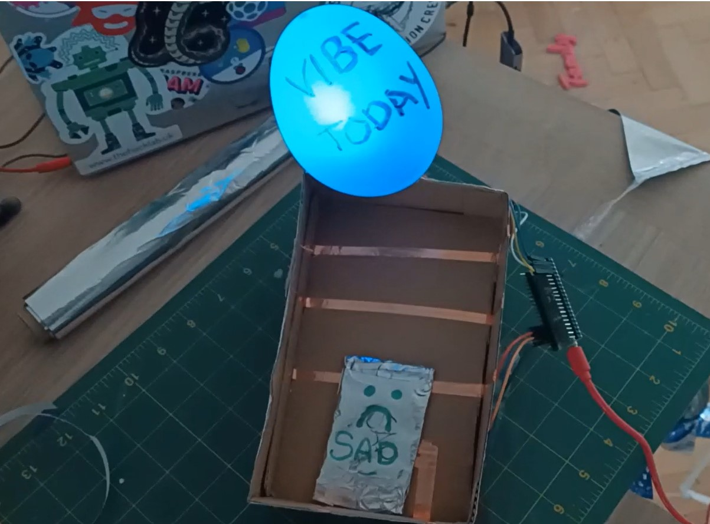

## Introduction

Create a mood check-in device with coloured lights to emote your current mood. 

Paying attention to your present mood is one way to support your wellbeing. Its okay to feel angry or sad, just as it is okay to feel happy or excited. A mood check-in is a time for you to notice how you are feeling and record it or let others know about it. 

You will:
+ **Represent** moods or emotions using colourful lights
+ Develop input controls for your device to allow the user to **check-in** their mood
+ Code LED(s) to create **light effects** based on different moods

To complete this project you will need:

+ A Raspberry Pi Pico with pin headers soldered on
+ A data USB A to micro USB cable
+ RGB LED(s) or single colour LED(s)
+ A potentiometer or buttons (bought or crafted)
+ Jumper wires
+ Resistors
+ Craft materials including card, sticky tape and kitchen foil

--- task ---

**Look:** Take a look at this mood check-in device. How does it use colour to communicate a mood? How do you change the colour displayed? 

Drop switch

--- /task ---

--- no-print ---

## Get inspiration

Explore these examples to get more ideas.

**Mood lamp**
A single button is used with a single RGB LED to create a mood lamp using a paper cup and some tracing paper. Each time the button is pressed, the colour changes. 

**Mood dial**
A potentiometer is used with a single RGB LED to create a mood dial. The user can turn the dial to 'check-in' their current mood.

**Focus indicator**
Three buttons and three single colour LEDs are used to show what support someone needs in a club. The 'Shh' emoji means do not disturb, the 'confused' emoji means that they are asking for help with their work and the 'smiley face' emoji means that they are happily working. 

**Vibe Checker**
Three switches and a single RGB LED are used with conductive tokens to show how you're feeling today. When the tokens are dropped in the box, they link the conductive bands and close the switches, lighting the LED different colours.

--- /no-print ---

--- print-only ---

## Get inspiration

Explore these examples to get more ideas.

**Mood lamp**
A single button is used with a single RGB LED to create a mood lamp using a paper cup and some tracing paper. Each time the button is pressed, the colour changes. 

**Mood dial**
A potentiometer is used with a single RGB LED to create a mood dial. The user can turn the dial to 'check-in' their current mood.

**Focus indicator**
Three buttons and three single colour LEDs are used to show what support someone needs in a club. The 'Shh' emoji means do not disturb, the 'confused' emoji means that they are asking for help with their work and the 'smiley face' emoji means that they are happily working. 

**Vibe Checker**
Three switches and a single RGB LED are used with conductive tokens to show how you're feeling today. When the tokens are dropped in the box, they link the conductive bands and close the switches, lighting the LED different colours.

--- /print-only ---

