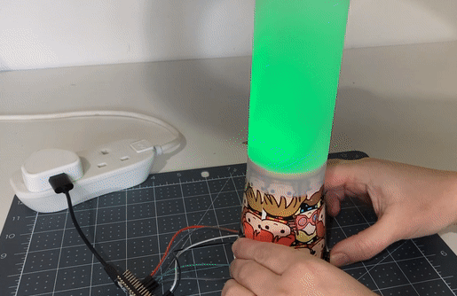
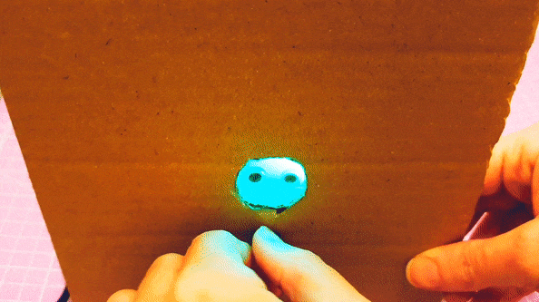

## You will make

Create a mood check-in device with coloured lights to emote your current mood. 

Paying attention to your present mood is one way to support your wellbeing. It's okay to feel angry or sad, just as it is okay to feel happy or excited. A mood check-in is a time for you to notice how you are feeling and record it or let others know about it. 

You will:
+ **Represent** moods or emotions using colourful lights
+ Develop input controls for your device to allow the user to **check-in** with their mood
+ Code LED(s) to create **light effects** based on different moods

To complete this project you will need:

**Hardware**

You can purchase all the required hardware for this project and the other projects in this path from the [Pimoroni web store.](https://shop.pimoroni.com/products/pico-intro-kit?variant=39893512945747){:target='_blank'} and the [The Kitronik web store.](https://kitronik.co.uk/products/5343-raspberry-pi-foundation-pico-pathway-pack){:target='_blank'}

+ A Raspberry Pi Pico with pin headers soldered on
+ A data USB A to micro USB cable
+ **Common cathode** RGB LED(s) or single-colour LED(s)
+ A potentiometer or buttons (bought or crafted)
+ Jumper wires
+ Resistors
+ Craft materials including card, sticky tape, and kitchen foil

**Software:**
+ Thonny – this project can be completed using the Thonny Python editor, which can be installed on a Linux, Windows, or Mac computer.

[[[thonny-install]]]

[[[change-theme-thonny]]]

+ picozero - you will need to set up picozero on your Raspberry Pi Pico

[[[set-up-picozero]]]

--- task ---

**Look:** Take a look at this mood check-in device. How does it use colour to communicate a mood? How do you change the colour displayed? 

--- collapse ---
---
title: See inside
---
--- code ---
---
language: python
filename: mood_lamp.py
line_numbers: true
line_number_start: 1
line_highlights: 
---
from picozero import RGBLED, Switch
from time import sleep

rgb = RGBLED(red=1, green=2, blue=3) # Pin numbers
switch = Switch(18)

option = 0

def calm():
    rgb.color = (255, 255, 0) # Yellow

def focused():
    rgb.color = (0, 215, 0) # Orange
    
def energised():
    rgb.color = (63, 204, 208) # Green

def choice():
    global option
    if option == 0:
        energised()
    elif option == 1:
        calm()
    elif option == 2:
        focused()
    elif option == 3:    
        rgb.off()
    
    if option == 3:
        option = 0
    else:
        option = option + 1
    

switch.when_closed = choice
--- /code ---

--- /collapse ---

--- /task ---

--- no-print ---

## Get ideas 💭

Explore these examples to get more ideas.

**Drop switch**
Different sized tokens are wrapped in kitchen foil with moods written on them. When they are placed in the box, they close different switches and set the light colour to match the mood. The tokens show a sad, happy, or angry mood. 

--- collapse ---
---
title: See inside
---
--- code ---
---
language: python
filename: drop_switch.py
line_numbers: true
line_number_start: 
line_highlights: 
---
from time import sleep
from picozero import Button, RGBLED

happy = Button(13) # Longest token
angry = Button(14) # Medium token
sad = Button(15) # Shortest token
led = RGBLED(18, 17, 16)

while True: # Create a loop that checks for the different tokens
    if happy.is_pressed: # Look for the longest token first
        print('happy!')
        led.color = (255,255,0) # Yellow
    elif angry.is_pressed: # Check for the medium token next
        print('ANGRY!')
        led.color = (255,0,0) # Red
    elif sad.is_pressed: # Check for the shortest token last
        print('sad and blue...')
        led.color = (0,125,255) # Blue

--- /code ---

--- /collapse ---

**Mood dial**
A potentiometer is used with a single RGB LED to create a mood dial. The user can turn the dial to 'check-in' their current mood.

--- collapse ---
---
title: See inside
---
--- code ---
---
language: python
filename: mood_dial.py
line_numbers: true
line_number_start: 
line_highlights: 
---

from picozero import RGBLED, Pot
from time import sleep

rgb = RGBLED(red=1, green=2, blue=3)
dial = Pot(0)

def happy():
    rgb.color = (0, 255, 0) # Green

def good():
    rgb.color = (75, 255, 0) # Yellow-green

def okay():
    rgb.color = (255, 150, 0) # Yellow

def unsure():
    rgb.color = (255, 25, 0) # Orange

def unhappy():
    rgb.color = (255, 0, 0) # Red

while True:
    mood = dial.value * 100 # turning to a percentage
    print(mood)
    if mood < 20:
        happy()
    elif mood < 40:
        good()
    elif mood < 60:
        okay()
    elif mood < 80:
        unsure()
    else:
        unhappy()
    sleep(0.1)

--- /code ---

--- /collapse ---

**Focus indicator**
Three buttons and three single-colour LEDs are used to show what support someone needs in a club. The 'Shh' emoji means do not disturb, the 'confused' emoji means that they are asking for help with their work, and the 'smiley face' emoji means that they are happily working. 

--- collapse ---
---
title: See inside
---
--- code ---
---
language: python
filename: focus_indicator.py
line_numbers: true
line_number_start: 
line_highlights: 
---
from picozero import LED, Speaker, Button
from time import sleep

eat = LED(13)
drink = LED(8)
play = LED(5)

speaker = Speaker(1)

choose = Button(18)
confirm = Button(22)

option = 0 # Store the current option

def choice(): # Call the next function and update the option
    global option
    if option == 0:
        shh.on()
        confused.off()
        smile.off()
    elif option == 1:
        shh.off()
        confused.on()
        smile.off()    
    elif option == 2:
        shh.off()
        confused.off()
        smile.on()   
    elif option == 3:
        shh.off()
        confused.off()
        smile.off()

    if option == 3:
        option = 0
    else:
        option = option + 1

def sound_buzzer():
    speaker.on()
    sleep(1)
    speaker.off()

choose.when_pressed = choice 
confirm.when_pressed = sound_buzzer
--- /code ---

--- /collapse ---

--- /no-print ---

--- print-only ---

## Get ideas 💭

Explore these examples to get more ideas.

**Mood lamp**
A single button is used with a single RGB LED to create a mood lamp using a paper cup and some tracing paper. Each time the button is pressed, the colour changes. 

**Mood dial**
A potentiometer is used with a single RGB LED to create a mood dial. The user can turn the dial to 'check-in' their current mood.

**Focus indicator**
Three buttons and three single-colour LEDs are used to show what support someone needs in a club. The 'Shh' emoji means do not disturb, the 'confused' emoji means that they are asking for help with their work, and the 'smiley face' emoji means that they are happily working. 

--- /print-only ---

