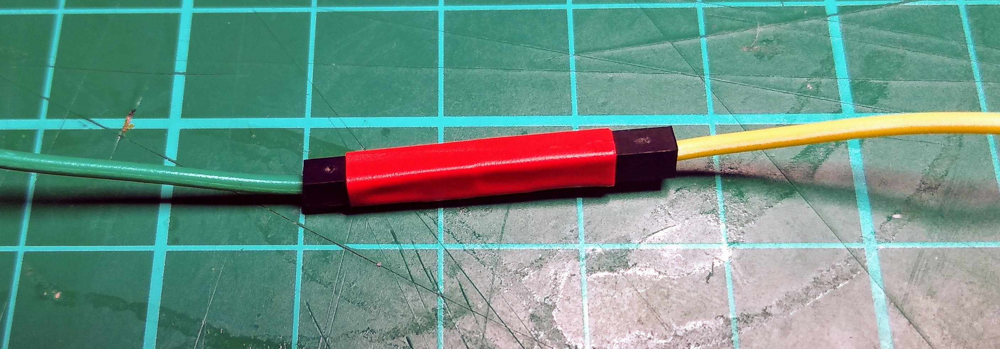

## Craft your device

Make the physical parts of your new mood check-in.

{:width="300px"}

--- task ---

**Think:** Some questions to consider in the design of the casing and interface for your mood check-in: 

+ What materials will you use? What do you have available?
+ What kind of switches will you make? How will they operate? (If you used them)
+ How will you mount your potentiometer so it is sturdy and easy to reach? (If you used one)
+ Where will you mount your LEDs for the best effect? Do you need to add any diffusers?

--- /task ---

In optics (the study of light and seeing), a <b>diffuser</b> is any material that scatters light in some way. Some LED bulbs are quite directed in their light and so can't be seen very well from a distance, or can be painfully bright to look at from the wrong angle. Using a diffuser can help stop these things from happening and make your light shine in a much more pleasing way. You can make a very simple diffuser just by covering your LED with a thin piece of paper.

--- task ---

**Find** the materials you will use to create the physical parts of your mood check-in.

You could use:
+ Cardboard boxes
+ Recycled plastic items
+ Old toys
+ Lego
+ Duct tape
+ Hot glue (ask an adult!)
+ Scissors (ask an adult!)
+ Craft knife (ask an adult!)
+ 3D printer (if you're very lucky!)

--- /task ---

--- task ---

**Make** the casing and interface parts for your mood check-in.

Be careful if you are using any sharp or hot tools and get adult permission and supervision before you start!

--- collapse ---

---
title: Mount components in card or plastic
---

You may want to mount LEDs, buttons, buzzers and potentiometers in card or plastic. 

If your components have soldered jumper wires, make a hole in the card or plastic and then push the component through from the back.

If you are using components with socket-socket jumper wires then remove the jumper wires and push the legs of the component through card. For plastic you will need make holes first by carefully using a tool with a sharp point. 

**Tip:** Remember which leg connects to which jumper wire. 

Then reconnect the jumper wires on the back of the card or plastic. 

If necessary you can use sticky tape or electrical tape to keep your components in place. 

--- /collapse ---

--- collapse ---

---
title: Diffuse light from LEDs
---

You often get a better visual effect by diffusing (spreading out) the light from an LED, especially if you are using clear LEDs or RGB LEDs that mix multiple colours. 

Placing an LED behind a material such as thin paper or invisible sticky tape will spread the light over a larger area and create a softer effect that is nicer to look at. 

You can also use a white material, such as paper to direct light in the direction you want it to be seen from so that you make the most of the light from the LED. 

--- /collapse ---

--- collapse ---

---
title: Use tape to hold jumper wires in place
---

Use sticky tape or electrical tape to hold jumper wires in place so that your device stays together. 

You can remove the tape later if you want to reuse the components. 

--- /collapse ---

--- collapse ---
---
title: Using a craft or utility knife
---

Craft and utility knives are very useful when making models, but you must be very careful when using them, as they are extremely sharp and can easily cause an injury. If you are using a craft or utility knife, make sure you have a responsible adult with you, or ask them to do the cutting for you if you prefer. It's also a good idea to use a cutting mat to protect the surface you are working on. If you don't have a cutting mat, a kitchen chopping board is a great alternative.

--- /collapse ---

--- /task ---

--- task ---

**Embed** your mood check-in components into your casing and **attach** them to your interface.

--- collapse ---
---
title: Joining together jumper wires
---

You might need extra-long wires to attach your LED to your Raspberry Pi pins. You can do this by 'daisy chaining' wires together. For instance, to make an extra-long socket-socket wire, you can attach an pin-socket wire to a socket-socket wire.

The problem with this method is that often the wires will become detached from each other. You can use a small piece of tape to secure the connection.

--- /collapse ---

--- /task ---

--- save ---