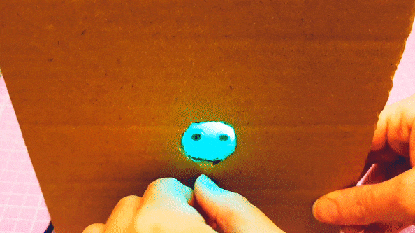
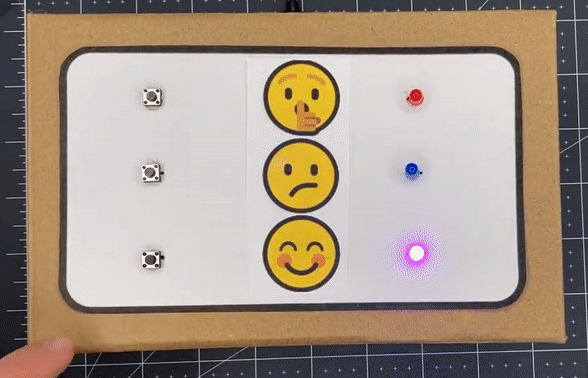

## Wat ga je maken

Maak een apparaat om je humeur te meten met gekleurde lampjes om je huidige stemming te laten zien.

Aandacht besteden aan je huidige stemming is een manier om je welzijn te ondersteunen. Het is oké om je boos of verdrietig te voelen, net zoals het oké is om je gelukkig of opgewonden te voelen. Met een humeurmeet-moment kun je kijken hoe je je voelt en dat vast te leggen of anderen erover te laten weten. 

Je gaat:
+ Stemmingen of emoties **laten zien** met kleurrijke lichtjes
+ Invoerknoppen ontwikkelen voor je apparaat zodat de gebruiker zijn humeur **kan meten**
+ LED('s) programmeren om **lichteffecten** te maken op basis van verschillende stemmingen

Om dit project te voltooien heb je het volgende nodig:

**Hardware**

Je kunt alle benodigde hardware voor dit project en de andere projecten in dit pad kopen in de [Pimoroni webwinkel.](https://shop.pimoroni.com/products/pico-intro-kit?variant=39893512945747){:target='_blank'} en de [Kitronik webwinkel.](https://kitronik.co.uk/products/5343-raspberry-pi-foundation-pico-pathway-pack){:target='_blank'}

+ Een Raspberry Pi Pico met gesoldeerde pinnen
+ Een data USB A naar micro USB-kabel
+ **Gemeenschappelijke kathode** RGB-LED('s) of eenkleurige LED('s)
+ Een potentiometer (instelwiel) of knoppen (gekocht of gemaakt)
+ Verbindingsdraden
+ Weerstanden
+ Knutselmaterialen zoals papier, karton, plakband en folie

**Software:**
+ Thonny – dit project kan worden voltooid met de Thonny Python editor, die kan worden geïnstalleerd op een Linux-, Windows- of Mac-computer.

[[[thonny-install]]]

[[[change-theme-thonny]]]

+ picozero - je moet picozero instellen op je Raspberry Pi Pico

[[[set-up-picozero]]]

--- task ---

**Bekijk:** Bekijk dit apparaat voor het meten van je humeur. Hoe gebruikt het kleur om een stemming te communiceren? Hoe wijzig je de weergegeven kleur?

--- collapse ---
---
title: Bekijk van binnen
---
--- code ---
---
language: python
filename: mood_lamp.py
line_numbers: true
line_number_start: 1
line_highlights: 
---
from picozero import RGBLED, Switch
from time import sleep

rgb = RGBLED(red=1, green=2, blue=3) # Pinnummers
schakelaar = Switch(18)

optie = 0

def rustig():
    rgb.color = (255, 255, 0) # Geel

def gefocust():
    rgb.color = (0, 215, 0) # Oranje
    
def energiek():
    rgb.color = (63, 204, 208) # Groen

def keuze():
    global optie
    if optie == 0:
        energiek()
    elif optie == 1:
        rustig()
    elif optie == 2:
        gefocust()
    elif optie == 3:    
        rgb.off()
    
    if optie == 3:
        optie = 0
    else:
        optie = optie + 1
    

schakelaar.when_closed = keuze

--- /code ---

--- /collapse ---

--- /task ---

--- no-print ---

## Ideeën opdoen 💭

Bekijk deze voorbeelden om meer ideeën te krijgen.

**Drop switch**
Verschillende grootte tokens worden in keukenfolie gewikkeld met stemmingen erop geschreven. Wanneer ze in de doos worden geplaatst, sluiten ze verschillende schakelaars en stellen ze de lichtkleur in die past bij de stemming. De tokens laten een droevige, gelukkige of boze stemming zien.

--- collapse ---
---
title: Bekijk van binnen
---
--- code ---
---
language: python
filename: drop_switch.py
line_numbers: true
line_number_start: 
line_highlights: 
---
from time import sleep
from picozero import Button, RGBLED

gelukkig = Button(13) # Langste token
boos = Button(14) # Gemiddeld token
verdrietig = Button(15) # Kortste token
led = RGBLED(18, 17, 16)

while True: # Maak een lus die de verschillende tokens controleert
    if gelukkig.is_pressed: # Zoek eerst naar het langste token
        print('gelukkig!')
        led.color = (255,255,0) # Geel
    elif boos.is_pressed: # Controleer vervolgens of het gemiddelde token wordt weergegeven
        print('BOOS!')
        led.color = (255,0,0) # Rood
    elif verdrietig.is_pressed: # Controleer het kortste token het laatst
        print('verdrietig...')
        led.color = (0,125,255) # Blauw

--- /code ---

--- /collapse ---

**Humeurmeter**
Een potentiometer (instelwiel) wordt gebruikt met een enkele RGB LED om een humeurmeter te maken. De gebruiker kan het instelwiel draaien om zijn huidige stemming 'te meten'.

--- collapse ---
---
title: Bekijk van binnen
---
--- code ---
---
language: python
filename: mood_dial.py
line_numbers: true
line_number_start: 
line_highlights: 
---

from picozero import RGBLED, Pot
from time import sleep

rgb = RGBLED(red=1, green=2, blue=3)
instelwiel = Pot(0)

def gelukkig():
    rgb.color = (0, 255, 0) # Groen

def goed():
    rgb.color = (75, 255, 0) # Geel-groen

def oke():
    rgb.color = (255, 150, 0) # Geel

def onzeker():
    rgb.color = (255, 25, 0) # Oranje

def ongelukkig():
    rgb.color = (255, 0, 0) # Rood

while True:
    humeur = dial.value * 100 # draaien naar een percentage
    print(humeur)
    if humeur < 20:
        gelukkig()
    elif humeur < 40:
        goed()
    elif humeur < 60:
        oke()
    elif humeur < 80:
        onzeker()
    else:
        ongelukkig()
    sleep(0.1)

--- /code ---

--- /collapse ---

**Focus-indicator**
Drie knoppen en drie eenkleurige LED's worden gebruikt om aan te geven wat iemand nodig heeft in een club. De 'Sst'-emoji betekent niet storen, de 'verwarde' emoji betekent dat ze om hulp vragen met hun werk, en de 'smiley face'-emoji betekent dat ze goed aan het werk zijn en geen hulp nodig hebben.

--- collapse ---
---
title: Bekijk van binnen
---
--- code ---
---
language: python
filename: focus_indicator.py
line_numbers: true
line_number_start: 
line_highlights: 
---
from picozero import LED, Speaker, Button
from time import sleep

eet = LED(13)
drink = LED(8)
speel = LED(5)

luidspreker = Speaker(1)

kies = Button(18)
bevestig = Button(22)

optie = 0 # Sla de huidige optie op.

def keuze(): # Roep de volgende functie op en werk de optie bij
    global optie
    if optie == 0:
        sst.on()
        verward.off()
        glimlach.off()
    elif optie == 1:
        sst.off()
        verward.on()
        glimlach.off()    
    elif optie == 2:
        sst.off()
        verward.off()
        glimlach.on()   
    elif optie == 3:
        sst.off()
        verward.off()
        glimlach.off()

    if optie == 3:
        optie = 0
    else:
        optie = optie + 1

def geluid_zoemer():
    luidspreker.on()
    sleep(1)
    luidspreker.off()

kies.when_pressed = keuze 
bevestig.when_pressed = geluid_zoemer

--- /code ---

--- /collapse ---

--- /no-print ---

--- print-only ---

## Ideeën opdoen 💭

Bekijk deze voorbeelden om meer ideeën te krijgen.

**Sfeerlamp**
Een enkele knop wordt gebruikt met een enkele RGB LED om een sfeerlamp te maken met behulp van een papieren beker en wat overtrekpapier. Elke keer dat op de knop wordt gedrukt, verandert de kleur.

**Stemmingswijzer**
Een potentiometer wordt gebruikt met een enkele RGB LED om een stemmingswijzer te maken. De gebruiker kan het instelwiel draaien om zijn huidige stemming 'in te checken'.

**Focus-indicator**
Drie knoppen en drie eenkleurige LED's worden gebruikt om aan te geven wat iemand nodig heeft in een club. De 'Sst'-emoji betekent niet storen, de 'verwarde' emoji betekent dat ze om hulp vragen met hun werk, en de 'blije'-emoji betekent dat ze met plezier werken.

--- /print-only ---

