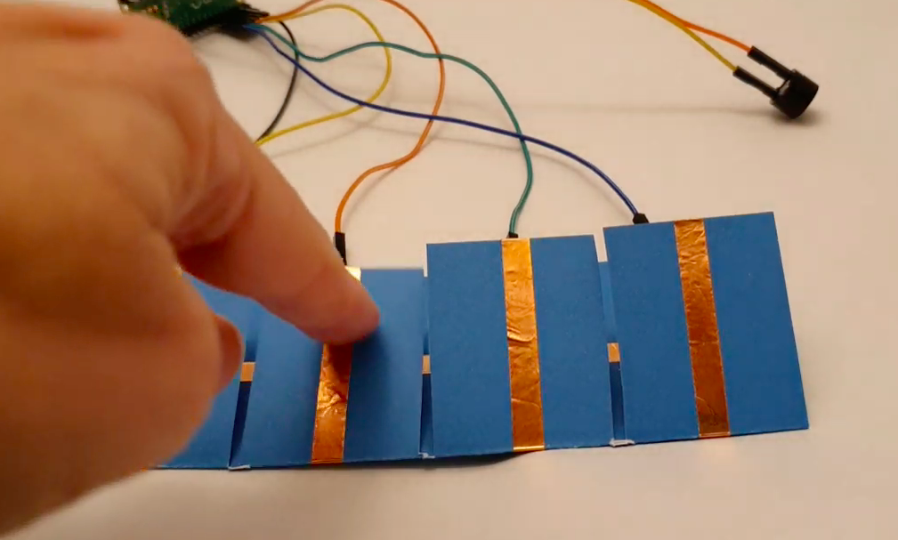

## Wat kun je verder nog doen?

Als je het [Inleiding tot de Raspberry Pi Pico](https://projects.raspberrypi.org/nl-NL/pathways/pico-intro) pad volgt, kun je naar het [Klankbord](https://projects.raspberrypi.org/nl-NL/projects/sound-machine) project gaan. In dit project maak je een klankbord dat geluidseffecten of muziek zal afspelen met knoppen, schakelaars of een potentiometer.

--- print-only ---

--- /print-only ---

--- no-print ---

<video width="640" height="360" controls>
<source src="images/sound_board.mp4" type="video/mp4">
Je browser ondersteunt geen WebM-video, probeer Firefox of Chrome
</video>

--- /no-print ---

***
Dit project werd vertaald door vrijwilligers:

Iny van Beuningen
Arnout Cator

Dankzij vrijwilligers kunnen we mensen over de hele wereld de kans geven om in hun eigen taal te leren. Jij kunt ons helpen meer mensen te bereiken door vrijwillig te starten met vertalen - meer informatie op [rpf.io/translate](https://rpf.io/translate).
